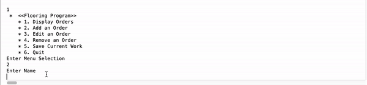

<!-- Carpentry Flooring Point of Sale App -->
<!--
*** I'm using markdown "reference style" links for readability.
*** Reference links are enclosed in brackets [ ] instead of parentheses ( ).
*** See the bottom of this document for the declaration of the reference variables
*** for contributors-url, forks-url, etc. This is an optional, concise syntax you may use.
*** https://www.markdownguide.org/basic-syntax/#reference-style-links
-->


<!-- PROJECT LOGO -->
<br />
<p align="center">
  <a href="https://github.com/othneildrew/Best-README-Template">
    
  </a>


<!-- ABOUT THE PROJECT -->
## About The Project

[![Product Name Screen Shot][product-screenshot]](Flooring/app.gif)

There are many great README templates available on GitHub, however, I didn't find one that really suit my needs so I created this enhanced one. I want to create a README template so amazing that it'll be the last one you ever need -- I think this is it.
UML 
Class Diagram 
* Use Crud to start building from 
* Take note to toggle between training & Prod mode will be done via the configuration file 
* The configuration file will write to Orders_DDMMYYY.txt

The UI should start with a menu to prompt the user for what they would like to do: 

 * * * * * * * * * * * * * * * * * * * * * * * * * * * * * * * * * * *
    *  <<Flooring Program>>
    * 1. Display Orders
    * 2. Add an Order
    * 3. Edit an Order
    * 4. Remove an Order
    * 5. Save Current Work
    * 6. Quit
    *
    * * * * * * * * * * * * * * * * * * * * * * * * * * * * * * * * * * *


Example : 

> package name
    +class name : interface/inheritence 
        + public name : return type
        - private name : return type

***************************************************************************************************
​* Ask Does Full Crud Apply to all of the DTO's? 


> com.mr.FlooringOrder.dtos


	 + Taxes
 		- State : String
 		- TaxRate : BigDecimal

	 + Products
 		- ProductType : String
 		- CostPerSquareFoot : Double
 		- LaborCostPerSquareFoot : Double 

	 + Orders 
		- Order # : int
		- Customer Name : String
		- State : String
		- Data/ Taxes : BigDecimal 
		- Product Type : String
		- Area : Double
		- Cost per Sq Foot : BigDecimal 
		- Labor Cost Per Sq Foot : BigDecimal
		- Material Cost : BigDecimal 
		- Labor Cost : BigDecimal 
		- Tax : BigDecimal
		- Total : BigDecimal  

>com.mr.FlooringOrder.daos

	+ OrderDao
		+ Create(Order order) : Order 
		+ ReadAll() : List <Order> 
		+ Update(Int order#) : Order 
		+ Delete(Int order#) : Order
		+ Save (Int order #) : Order 

	 + OrderDaoFileProdImpl : OrderDao
	 	- orders : Map< <Order>  
	 	- FILENAME : String
	 	+ OrderDaoFileImpl(String fileName)
	 	- save() : void throws PersistanceException
	 	- load() : void throws PersistanceException

	  + OrderDaoFileTrainingImpl : OrderDao
	 	- orders : Map <Order>  
	 	- FILENAME : String
	 	+ OrderDaoFileImpl(String fileName)
	 	- load() : void throws PersistanceException

	 + StateTaxDao 
	 	+ ReadAll() : HashMap <StateTax> StateTax
	 	+ Read() : StateTax

	 + ProductDao 
	    + ReadAll() : List <ProductDao>


>com.mr.FlooringOrders.Service
 
	+FlooringOrderService 
	Exception e : Exception 
	DuplicateOrderException : Exception 
	InvalidOrderException : Exception 
	OrderNotFoundException : Exception 
	PersistanceException : Exception 

		+ DisplayAllOrders : Map <Order> throws Exception e
		+ AddOrder(Order order): Order  throws DuplicateOrderException , InvalidOrderException
		+ EditOrder(Order order) : Order  throws InvalidOrderException
		+ RemoveOrder(Order order) : Order throws InvalidOrderException, OrderNotFoundException
		+ SaveOrder(Order order) : Order  throws PersistanceException

		+ getCustomerName(String) : Order // ??? Do we make 4 seperate methods for the view to be checked in the service Layer  


	+ FlooringOrderServiceImpl : FlooringOrderService
		-  FlooringOrderDao : FlooringOrderDao 
		-  StateTaxDao : StateTaxDao
		-  ProductDao : ProductDao
		+ FlooringOrderServiceImpl(OrderDao orderDao, ProductDao productDao)

> com.mr.FlooringOrders.ui
  +FlooringOrders.view 
	+ getMenuSelection() : int 
	+ addOrderNumber() : int 
	+ getCustomersName() : String
	+ getState() : String
	+ getArea() : double
	+ getProductType() : String
	+ getStateTaxRate() : BigDecimal 
	+ displayAllOrders(List<Order> orders) : void

> com.mr.FlooringOrders.controller
    + FlooringOrdersController
        - service : FlooringOrdersService
        - view : FlooringOrdersView
        + FlooringOrdersController(FlooringOrdersService service, FlooringOrdersView view)
        + run() : void
        - addOrder() : void
        - editOrder() : void
        - removeOrder() : void
        - saveUser() : void
        - viewAllOrders() : void
        


Here's why:
* Your time should be focused on creating something amazing. A project that solves a problem and helps others
* You shouldn't be doing the same tasks over and over like creating a README from scratch
* You should implement DRY principles to the rest of your life :smile:

Of course, no one template will serve all projects since your needs may be different. So I'll be adding more in the near future. You may also suggest changes by forking this repo and creating a pull request or opening an issue. Thanks to all the people have have contributed to expanding this template!

A list of commonly used resources that I find helpful are listed in the acknowledgements.

### Built With

This section should list any major frameworks that you built your project using. Leave any add-ons/plugins for the acknowledgements section. Here are a few examples.
* [Bootstrap](https://getbootstrap.com)
* [JQuery](https://jquery.com)
* [Laravel](https://laravel.com)


<!-- GETTING STARTED -->
## Getting Started

This is an example of how you may give instructions on setting up your project locally.
To get a local copy up and running follow these simple example steps.

### Prerequisites

This is an example of how to list things you need to use the software and how to install them.
* npm
  ```sh
  npm install npm@latest -g
  ```

### Installation

1. Get a free API Key at [https://example.com](https://example.com)
2. Clone the repo
   ```sh
   git clone https://github.com/your_username_/Project-Name.git
   ```
3. Install NPM packages
   ```sh
   npm install
   ```
4. Enter your API in `config.js`
   ```JS
   const API_KEY = 'ENTER YOUR API';
   ```


<!-- USAGE EXAMPLES -->
## Usage

Use this space to show useful examples of how a project can be used. Additional screenshots, code examples and demos work well in this space. You may also link to more resources.

_For more examples, please refer to the [Documentation](https://example.com)_


<!-- ROADMAP -->
## Roadmap

See the [open issues](https://github.com/othneildrew/Best-README-Template/issues) for a list of proposed features (and known issues).


<!-- CONTRIBUTING -->
## Contributing

Contributions are what make the open source community such an amazing place to be learn, inspire, and create. Any contributions you make are **greatly appreciated**.

1. Fork the Project
2. Create your Feature Branch (`git checkout -b feature/AmazingFeature`)
3. Commit your Changes (`git commit -m 'Add some AmazingFeature'`)
4. Push to the Branch (`git push origin feature/AmazingFeature`)
5. Open a Pull Request


<!-- LICENSE -->
## License

Distributed under the MIT License. See `LICENSE` for more information.


<!-- CONTACT -->
## Contact

Your Name - [@your_twitter](https://twitter.com/your_username) - email@example.com

Project Link: [https://github.com/your_username/repo_name](https://github.com/your_username/repo_name)


<!-- ACKNOWLEDGEMENTS -->
## Acknowledgements
* [GitHub Emoji Cheat Sheet](https://www.webpagefx.com/tools/emoji-cheat-sheet)
* [Img Shields](https://shields.io)
* [Choose an Open Source License](https://choosealicense.com)
* [GitHub Pages](https://pages.github.com)
* [Animate.css](https://daneden.github.io/animate.css)
* [Loaders.css](https://connoratherton.com/loaders)
* [Slick Carousel](https://kenwheeler.github.io/slick)
* [Smooth Scroll](https://github.com/cferdinandi/smooth-scroll)
* [Sticky Kit](http://leafo.net/sticky-kit)
* [JVectorMap](http://jvectormap.com)
* [Font Awesome](https://fontawesome.com)


<!-- MARKDOWN LINKS & IMAGES -->
<!-- https://www.markdownguide.org/basic-syntax/#reference-style-links -->
[contributors-shield]: https://img.shields.io/github/contributors/othneildrew/Best-README-Template.svg?style=for-the-badge
[contributors-url]: https://github.com/othneildrew/Best-README-Template/graphs/contributors
[forks-shield]: https://img.shields.io/github/forks/othneildrew/Best-README-Template.svg?style=for-the-badge
[forks-url]: https://github.com/othneildrew/Best-README-Template/network/members
[stars-shield]: https://img.shields.io/github/stars/othneildrew/Best-README-Template.svg?style=for-the-badge
[stars-url]: https://github.com/othneildrew/Best-README-Template/stargazers
[issues-shield]: https://img.shields.io/github/issues/othneildrew/Best-README-Template.svg?style=for-the-badge
[issues-url]: https://github.com/othneildrew/Best-README-Template/issues
[license-shield]: https://img.shields.io/github/license/othneildrew/Best-README-Template.svg?style=for-the-badge
[license-url]: https://github.com/othneildrew/Best-README-Template/blob/master/LICENSE.txt
[linkedin-shield]: https://img.shields.io/badge/-LinkedIn-black.svg?style=for-the-badge&logo=linkedin&colorB=555
[linkedin-url]: https://linkedin.com/in/othneildrew
[product-screenshot]: images/screenshot.png
